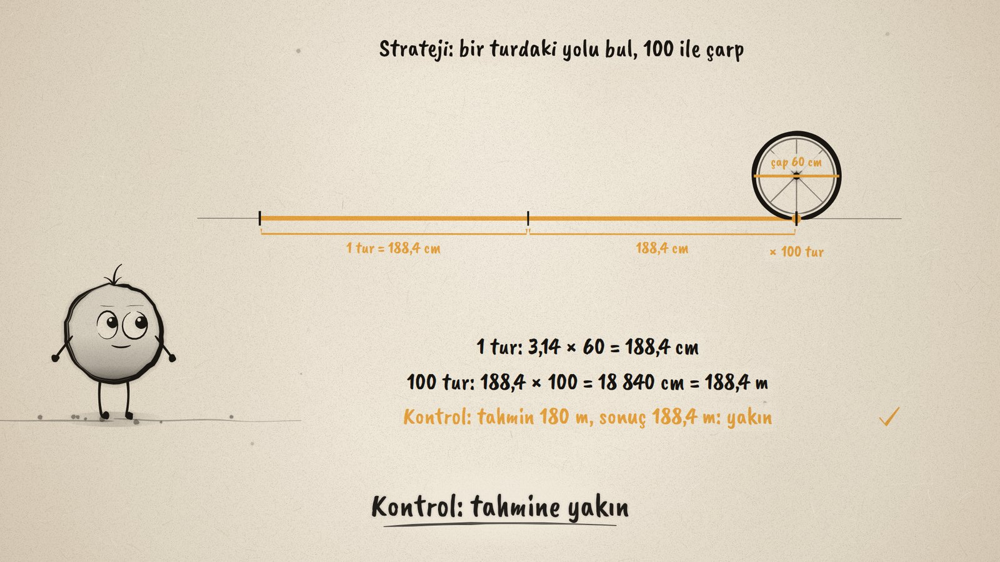
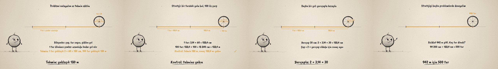

# Kaç Metre Gider? · Circumference Problems

**▶ Tarayıcıda izleyin / Watch in the browser:** https://hakanatas.github.io/tekerlek-kac-tur/ 
**⬇ MP4 + altyazılar / MP4 + subtitles:** [Releases](https://github.com/hakanatas/tekerlek-kac-tur/releases) 
**✎ Kullanılan istem / The prompt behind it:** [PROMPT.md](PROMPT.md) 
**🎞 Bütün filmler / All films:** [Nokta'nın Filmleri](https://hakanatas.github.io/nokta-filmleri/?sinif=6)

> **TR —** 6. sınıf matematik "Geometrik Nicelikler" temasındaki MAT.6.4.5 öğrenme çıktısı için hazırlanmış, tamamen JavaScript ile çizilen 92 saniyelik mürekkep animasyonu. Çapı 60 cm olan bir bisiklet tekerleği yolda dönüyor: 100 turda kaç metre gider? Bileşenler belirleniyor (çap, tur sayısı, gidilen yol); tekerlek bir tur dönünce çember uzunluğu kadar yol alıyor. Tahmin: π yerine 3 ile bir tur yaklaşık 180 cm, 100 tur yaklaşık 180 m. Çözüm: 3,14 × 60 = 188,4 cm, 100 turda 18 840 cm = 188,4 m; tahminle karşılaştırılıyor. Başka bir yol: yarıçapla 2 × 3,14 × 30 = 188,4 cm, aynı sonuç. Strateji genelleniyor: 942 m giden bisiklet 94 200 ÷ 188,4 = 500 tur dönmüş; çapı 50 cm olan tekerlek 100 turda 157 m gider. Altyazılar Türkçe, İngilizce ya da ikisi birlikte seçilebilir.

A 92-second ink animation for **6th-grade maths**, the fifth film of the fourth 6th-grade theme. Nokta, the ink character from [The Learning Ink](https://github.com/hakanatas/the-learning-ink), is the guide again. The wheel rolls without slipping (`roll` in `src/draw/film.js`), so each tick on the road is exactly one circumference from the last, and the turn counter above the wheel is the angle it has turned divided by a full turn.

## Learning outcome

MEB, Türkiye Yüzyılı Maarif Modeli, Ortaokul Matematik, 6th grade, "Geometrik Nicelikler" theme:

**MAT.6.4.5. Çap veya yarıçap uzunluğu verilen bir çemberin uzunluğu ile ilgili problemleri çözebilme**
- a) Çap veya yarıçap uzunluğu verilen bir çemberin uzunluğu ile ilgili problemlerde ilgili matematiksel bileşenleri (çap, yarıçap, çevre uzunluğu gibi) belirler.
- b) Matematiksel bileşenler arasındaki ilişkiyi belirler.
- c) Problem bağlamıyla ilişkili verilenleri uygun matematiksel temsillere dönüştürür.
- ç) Matematiksel temsillere dönüştürdüğü problemi kendi ifadeleri ile açıklar.
- d) Problemlerin sonucuna ilişkin tahminde bulunur ve işlemleri gerçekleştirmek için stratejiler geliştirir.
- e) Belirlediği stratejileri çözüm için uygular.
- f) Çözüm yollarını kontrol eder ve çözüme ulaştırmayan stratejiyi değiştirir.
- g) Problemin çözümü için kullandığı veya geliştirdiği stratejileri gözden geçirerek alternatif çözüm yollarını değerlendirir.
- ğ) Kullandığı strateji veya stratejileri farklı problemlerin çözümlerine geneller.
- h) Genellemenin geçerliliğini matematiksel örneklerle değerlendirir.

## Scenes

| # | Time | Scene | What happens | Outcome |
|---|---|---|---|---|
| 1 | 0–10 s | Bisiklet tekerleği | A wheel 60 cm across rolls two turns: how far in 100 turns? | a |
| 2 | 10–28 s | Problemi anla | Diameter, turns, distance; one turn is one circumference; estimate about 180 m. | a, b, c, ç, d |
| 3 | 28–46 s | Çöz ve kontrol et | 3.14 × 60 = 188.4 cm, × 100 = 188.4 m, close to the estimate. | e, f |
| 4 | 46–62 s | Başka bir yol | With the radius: 2 × 3.14 × 30 = 188.4 cm, the same answer. | g |
| 5 | 62–80 s | Genelle | 942 m means 500 turns; a 50 cm wheel goes 157 m in 100 turns. | ğ, h |
| 6 | 80–92 s | Aklında kalsın | Distance = turns × π × diameter. | d–h |

## Running it

- **Preview:** double-click `index.html` (it works offline).
- **MP4:** run `npm install` once, then `npm run export -- --format=horizontal --captions=tr`.
- **Subtitles and narration:** `npm run srt` writes `out/captions_*.srt` and `narration_notes.txt`.
- **Editing:**
  - Caption text, timings and narration notes: `captions.js`
  - Everything on screen is drawn by `LI.world(t)` in `scenes/scene1.js` (the wheel, the road and its marks, the counters, the words); the other scenes only set the camera.
  - Circles, the rolling wheel, brackets and Nokta's poses: `src/draw/film.js`; layout for 16:9 and 9:16: `src/draw/kd.js`

It uses the same engine as The Learning Ink: `renderFrame(t)` as a pure function of time, seeded randomness, and frame-by-frame export.

## Lisans · License

**TR —** Bu film ve kodu [Creative Commons Atıf-GayriTicari 4.0 Uluslararası (CC BY-NC 4.0)](https://creativecommons.org/licenses/by-nc/4.0/deed.tr) lisansıyla paylaşılır. Ticari olmayan her amaçla (derste, okulda, eğitim materyalinde) kopyalayabilir, paylaşabilir ve değiştirebilirsiniz; ancak **kaynak göstermek zorunludur**: eser sahibinin adı ve bu deponun bağlantısı belirtilmeden kullanılamaz. Ticari kullanım (satış, ücretli ürün ya da yayın) için izin alınmalıdır.

**EN —** This film and its code are licensed under [Creative Commons Attribution-NonCommercial 4.0 International (CC BY-NC 4.0)](https://creativecommons.org/licenses/by-nc/4.0/). You may copy, share and adapt them for non-commercial purposes, but **attribution is required**: they may not be used without crediting the author and linking to this repository. Commercial use requires permission.

Atıf örneği / Required credit: *“Kaç Metre Gider?”, Hakan Ataş, Nokta'nın Filmleri — https://github.com/hakanatas/tekerlek-kac-tur — CC BY-NC 4.0*
